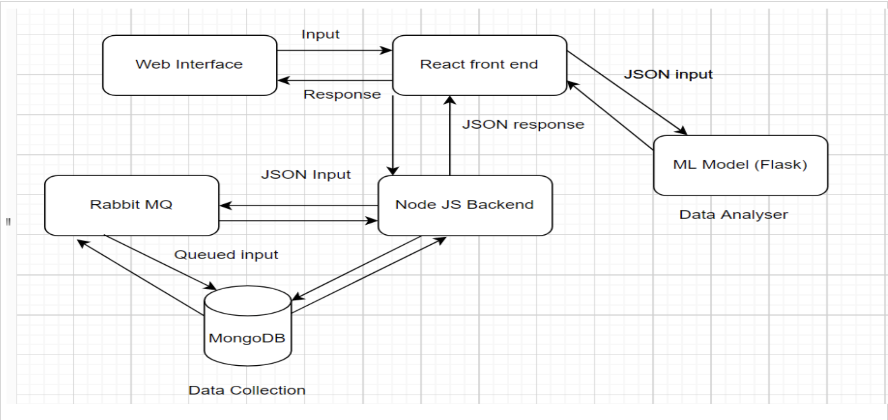

# Personality Detection from Tweets

## CSCI 5828 Spring 2022 Project

### Team Members

1. Aayush Shah
2. Devansh Mehta
3. Chaitanya Arepalli
4. Kunal Mehta
5. Anuhya Mandalapu

Staging:
https://twitter-analysis-staging.herokuapp.com 
Production:
https://twitter-analysis-production.herokuapp.com

Our project aims at creating a web app that can analyse and predict a user's personality based on their tweets. The tech stack used is React.js, Node.js, Python.

[Backend Github Repo](https://github.com/aayushshahh/backend-twitter-analysis)  
[ML Model Repo](https://github.com/kunakl07/personalityDetection)

# ArchitecturalDiagram

Read Wiki for more info
